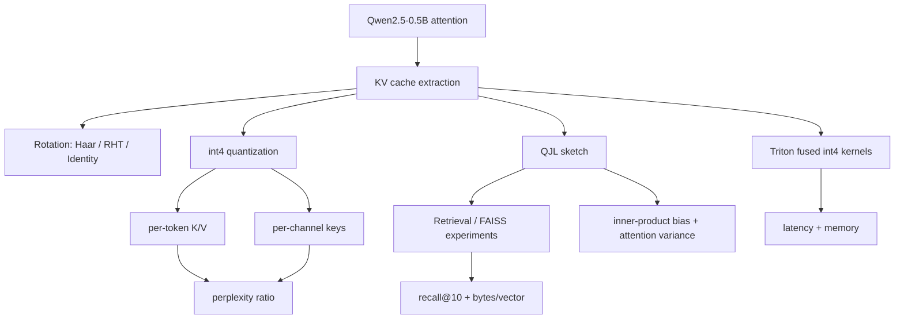
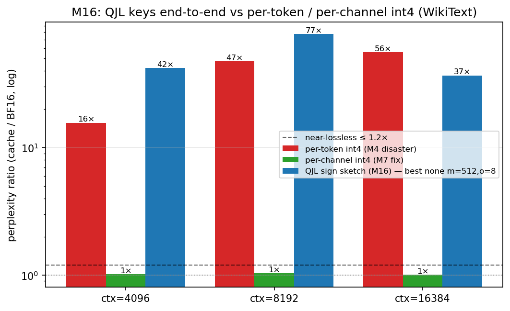
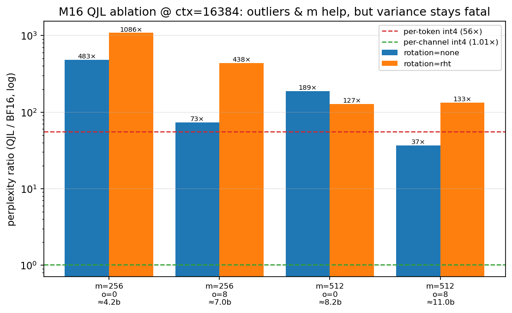
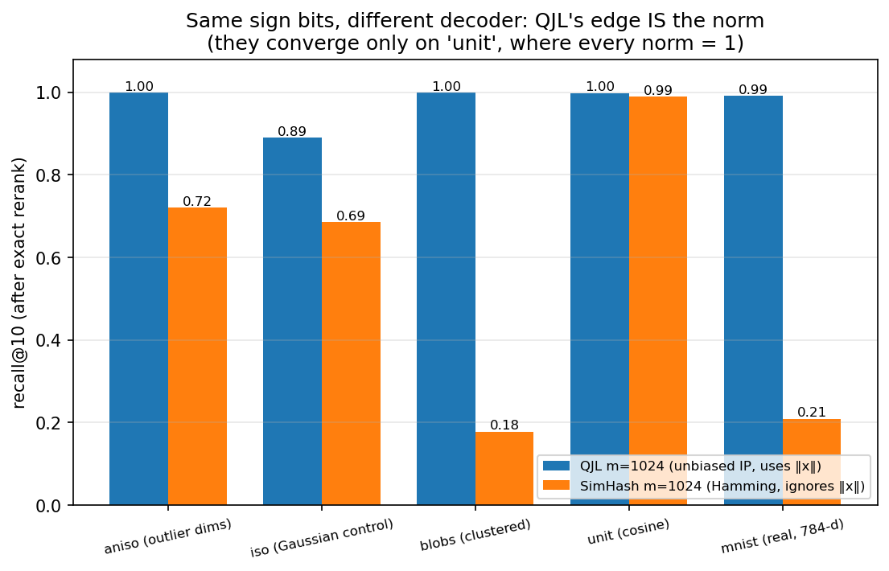

# KV‑cache quantization from scratch: rotation, int4, QJL, and the benchmark traps

> *aka "KV-cache quantization from scratch: rotation, int4, QJL, and the benchmark traps."* A hands‑on **ML systems** case study inspired by
> [**TurboQuant**](https://arxiv.org/abs/2504.19874), run end‑to‑end on a real model
> (**Qwen2.5‑0.5B‑Instruct**) and a real GPU (**A100‑80GB**).
>
> **Not a full reproduction of the TurboQuant paper** — a *mechanism‑level* study inspired by it:
> rotation, scalar int4 quantization, QJL residuals, KV‑cache evaluation, and retrieval transfer.

## What this repo proves

I implemented, from scratch, a full KV‑cache quantization stack and stress‑tested it end‑to‑end:

- a **rotated int4 KV cache** for Qwen2.5‑0.5B (rotate‑query identity; per‑token **and** per‑channel quant)
- **QJL** residual + direct sign sketches for unbiased inner‑product estimates
- **fused Triton int4 attention kernels** (nibble unpack in‑register, no full dequant)
- **retrieval experiments** with FAISS

**The headline result.** Naive **per‑token** int4 KV looked *near‑lossless* on repeated text — then
failed badly on real WikiText (**15–57× worse perplexity**). Switching the **keys to per‑channel**
quantization flipped that to **~1.01–1.03× of BF16** (near‑lossless) — a 15–55× improvement from one
principled change.

**The deeper lesson.** KV quantization is not one trick. The outcome depends on the **evaluation data**,
the **key/value statistics**, **RoPE placement**, **outlier handling**, the **GPU kernel path**, and —
the through‑line of the whole project — whether the **downstream consumer tolerates bias or variance**.

## Results at a glance

| Question | Experiment | Result | Lesson |
| --- | --- | --- | --- |
| Can naive int4 KV look good? | repeated text vs WikiText | repeated text hid the failure; WikiText exposed **15–57×** worse perplexity | bad eval data can make quantization look "solved" |
| What fixed the failure? | per‑token keys vs **per‑channel** keys | **55.7× → 1.01×** at 16k context | key *outlier channels* dominate KV quantization |
| Does QJL help attention? | end‑to‑end QJL attention path | bias improved, but **variance** made perplexity much worse | unbiased is not automatically useful under softmax |
| Does QJL help retrieval? | FAISS shortlist‑then‑rerank | **near‑lossless** recall at **24–47× compression** | retrieval can absorb sketch variance |
| Does int4 make decode faster? | Triton fused int4 vs BF16/cuBLAS | lower memory, but **12–48× slower** at head_dim=64 | compression is not automatically speed |

## Verify the headline result

Don't run the whole repo — reproduce the headline (per‑token vs per‑channel keys) from committed CSVs:

```bash
pip install -r requirements.txt
python benchmarks/report_m7.py     # → results/plots/m7_per_channel_fix.png + results/tables/m7_gate.md
```

It regenerates: per‑token int4 **~15–57×** worse perplexity → per‑channel keys **~1.01–1.03× BF16**.
(Full reproduction — every CPU plot and the A100 jobs — is in [§6](#6-reproduce-it).)

## Architecture



## Why this matters

Long‑context inference is usually bottlenecked by **KV‑cache memory**, not model weights. Compressing the
cache can unlock longer context or larger batches — but the quality/speed trade‑offs are subtle. This
project shows why an "obvious" int4 cache actually depends on the **quantization axis**, the
**key/value statistics**, the **attention objective**, and the **GPU kernel path** — and where the same
idea pays off (retrieval) versus where it doesn't (dense attention).

> This repo is a **case study**, not a library to deploy: it shows the wins, the dead‑ends, the bugs, and
> the honest negative results — every number measured, every plot regenerable from committed data.

---

## 1. The problem, in one picture

When an LLM generates text, it remembers every previous token as a pair of vectors — a **key** and a
**value** — stored in the **KV cache**. The longer the conversation, the bigger this cache grows:

$$\text{KV bytes} = 2 \times (\text{layers}) \times (\text{tokens}) \times (\text{heads}) \times (\text{head dim}) \times (\text{bytes per number}).$$

At long context the KV cache, not the model weights, becomes the thing that won't fit in GPU memory.
The obvious fix is to store each number in **fewer bits** — say 4 instead of 16 (`bfloat16`), a 4×
saving. The catch: naive 4‑bit quantization wrecks quality, because a few "outlier" coordinates hog
the entire numeric range and crush everything else to zero.

## 2. The paper's big idea: rotate before you quantize

[TurboQuant](https://arxiv.org/abs/2504.19874) (2025) builds on a beautiful trick. Attention only
ever uses the **dot product** $q^\top k$. If you multiply both vectors by the same rotation matrix
$R$, the dot product is unchanged:

$$q^\top k = (Rq)^\top (Rk).$$

So you can **store the rotated key $Rk$** and, at decode time, **rotate the live query $Rq$** — the
logits come out identical. Why bother? Because a random rotation **spreads energy evenly** across all
coordinates (think of it as shaking a jar so no single grain dominates). After rotation, no
coordinate is an outlier, so a dumb little per‑token 4‑bit quantizer becomes near‑optimal.

The paper's deepest claim is the one most people skip:

> **Minimizing reconstruction error (MSE) is not the same as preserving the dot product.**
> The MSE‑optimal quantizer is *biased* for inner products — it systematically shrinks them. To fix
> the bias you add a tiny **1‑bit "QJL" sketch** of the leftover error.

I set out to see all of this happen on a real model — and to find out where it breaks.

## 3. What I built

A small, dependency‑light toolkit + a milestone‑gated experiment harness that runs on an A100:

| Module | What it does |
| --- | --- |
| [`turbo_kv/rotations.py`](turbo_kv/rotations.py) | Identity / dense‑Haar / **Randomized Hadamard** ($R=D_1HD_2H$, the fast $O(d\log d)$ rotation) |
| [`turbo_kv/quantizers.py`](turbo_kv/quantizers.py), [`packing.py`](turbo_kv/packing.py) | per‑token / per‑channel scalar quant, int4 bit‑packing (2 codes per byte) |
| [`turbo_kv/cache.py`](turbo_kv/cache.py) | `TurboKVCache`: a drop‑in HF cache = BF16 recent window + rotated int4 history |
| [`turbo_kv/qwen_patch.py`](turbo_kv/qwen_patch.py) | patches Qwen2 attention for the **rotate‑query** identity (one inverse‑rotation per head) |
| [`turbo_kv/qjl.py`](turbo_kv/qjl.py) | the **1‑bit QJL residual** for unbiased dot‑product estimates |
| [`kernels/`](kernels/) | fused **int4 Triton kernels** that unpack nibbles in‑register (no full dequant) |
| [`benchmarks/`](benchmarks/) | the experiments + plot/table generators for each milestone |
| [`results/`](results/) | every CSV, plot, table, and [`runs.md`](results/runs.md) — the PASS/FAIL lab log |

The model is **Qwen2.5‑0.5B‑Instruct** (24 layers, 14 query heads, 2 KV heads, head_dim 64) on a
single **A100‑80GB**. Each experiment is one GPU job; results are downloaded and turned into plots.

---

## 4. Eight findings worth your time

### Finding 1 — Rotation only helps if you quantize *per token*

There are two ways to pick the 4‑bit scale: one scale **per channel** (column) or one **per token**
(row). It turns out this choice is the whole ballgame.


- **Per channel**, each outlier coordinate already gets its own scale, so rotation does *nothing*
  (even slightly hurts).
- **Per token**, one outlier coordinate inflates the whole row's scale — exactly where spreading the
  energy with a rotation helps. RHT beat "no rotation" in **12 / 12** layer×bit‑width cells; the worst
  layer's inner‑product RMSE dropped from **1565 → 252**.

> **Lesson:** a technique isn't "good" or "bad" in a vacuum — it's good *relative to a baseline*.
> Rotation is pointless against a strong per‑channel quantizer and essential against a per‑token one.

### Finding 2 — The benchmark that lied (and how I caught it)

My first end‑to‑end test said int4 KV was **near‑lossless**. I almost believed it. Then I noticed my
test context was the *same paragraph repeated* to fill 4–16k tokens. On repetitive text the model
just copies what it already saw, so it barely needs the cache to be accurate — the corruption hides.

When I swapped in **real WikiText‑2** (genuine, non‑repeating prose) the truth came out:


| context | perplexity ratio (int4 / BF16), repeated text | **…real WikiText** |
| --- | --- | --- |
| 4k | 5.9× | **16×** |
| 8k | (noisy) | **25–57×** |
| 16k | 188× | **15–56×** |

On clean text, **plain 4‑bit per‑token KV is 15–57× worse perplexity** — not near‑lossless at all,
and *no* rotation rescues it on its own. This overturned my own earlier "win" and set up the real
question for the paper's residual trick.

> **Lesson:** if a quantization result looks too good, check whether your eval text is *easy*.
> Repetition + induction heads can mask almost any KV damage. Always test on held‑out, non‑repeating
> data. (This single check changed the project's entire conclusion.)

> ⚠️ **But hold that thought.** Was per‑token int4 KV actually doomed — or did *we* do it wrong? The
> answer (it was us) is the redemption in **Finding 5**.

### Finding 3 — MSE‑optimal ≠ inner‑product‑optimal (the paper was right)

Here's the subtle claim made concrete. I quantized real Qwen keys and looked at the **signed error**
of the recovered dot products:


The plain MSE quantizer's errors are **shifted off zero** (mean −267 to −1078) — it's *biased*, it
systematically under‑estimates similarity. Adding the **1‑bit QJL residual** re‑centers the estimate
on zero, exactly as the theory predicts. At 4 bits the bias drops **30×** (66.7 → 1.1).

Does removing the bias buy better attention? Yes — but only if you spend enough sketch bits:


Plain MSE attention‑KL **saturates around 6.5** no matter how many bits you give it. The QJL variant
(`prod‑4b`) is the *only* thing that breaks below that floor (down to 3.9) — it reaches a quality MSE
quantization simply **cannot**, at the cost of a wider sketch. With a single 1‑bit sketch the win
only shows near 4 bits, which matches the paper's own "3.5‑bit neutral, 2.5‑bit marginal" note.

> **Lesson:** two errors with the *same size* can have very different *shapes*. A biased estimator is
> dangerous in a way a noisy‑but‑centered one isn't, because the bias compounds across thousands of
> keys in a softmax.

### Finding 4 — A "fast" int4 kernel that is honestly slow

The dream ending is a fused GPU kernel that reads the tiny int4 store and beats everything. I wrote
two Triton kernels that unpack 4‑bit nibbles **in‑register** and never materialize the dequantized
K/V. They're **correct** (logits match the reference to *exactly* 0.0) and they **do** use less peak
memory. But are they *faster*? I compared three decode paths honestly:


| context | plain BF16 (no quant) | dequant→cuBLAS | **fused int4** | fused vs BF16 |
| --- | --- | --- | --- | --- |
| 1k | **0.034 ms** | 0.284 ms | 0.412 ms | **12× slower** |
| 16k | **0.049 ms** | 0.281 ms | 2.326 ms | **48× slower** |

Plain `bfloat16` attention wins by a mile. At `head_dim=64` the work per step is tiny and NVIDIA's
cuBLAS (with tensor cores) is nearly impossible to beat with a hand‑written kernel that uses fp32 math
for exactness. The fused kernel achieved only **0.3–35 GB/s** vs the A100's ~2 TB/s — it's
launch/occupancy‑bound, not bandwidth‑bound.

> **Lesson:** int4 KV is a **memory** optimization, not a **speed** one. It lets you fit a longer
> context or a bigger batch that BF16 couldn't — but the attention math itself gets *slower*, not
> faster. Beating cuBLAS needs real int4 tensor‑core kernels (Marlin/Machete‑class), which is a
> different project. Reporting this honestly is the whole point.

### Finding 5 — The redemption: it was our mistake, and here's the fix

Finding 2's headline — 4‑bit KV is **15–57× worse** — was real and correctly measured. But then I went
and read what the methods that *actually work* (KIVI, KVQuant, and TurboQuant's own QJL implementation)
do differently, and the answer was humbling: **they quantize keys *per channel*; we quantized *per
token*.**

Keys have persistent outlier **channels** — a few coordinates that are large for almost every token. A
*per‑token* scale (one range per row) lets a single outlier channel blow up the whole token's range,
crushing the other 63 coordinates toward zero. A *per‑channel* scale (one range per column) gives that
outlier channel its own range and leaves the rest intact. So I added a per‑channel key mode and reran
the **exact same WikiText eval**:


| context | per‑token keys (our mistake) | **per‑channel keys (the fix)** | improvement |
| --- | --- | --- | --- |
| 4k | 15.6× | **1.02×** | 15× |
| 8k | 47.3× | **1.03×** | 46× |
| 16k | 55.7× | **1.01×** | 55× |

One principled change takes int4 KV from **15–57× worse** to **near‑lossless (≈1.01–1.03×)** — and we
got there even though we still quantize *post*‑RoPE (KVQuant shows pre‑RoPE would help further). The
earlier negative result wasn't a dead end; it was a controlled demonstration of *why* the entire field
quantizes keys per channel.

> **Lesson:** a negative result is only as trustworthy as your grasp of the baseline. Before concluding
> "X doesn't work," check how the people who got X to work actually did it. Here the bug wasn't int4 —
> it was *me*, and three papers' worth of design choices turned a 55× failure into a 1.01× success.

---

### Finding 6 — The field's whole toolbox (and *three* ways to fix one bug)

Finding 5 fixed the 55× disaster one way — per‑channel keys. But that is only the first item on the
field's checklist. So I implemented the **other seven refinements** that KIVI, KVQuant, and QJL stack on
top, and validated each on the A100 (one even crashed first — a missing `import torch` in a rarely‑hit
branch that `py_compile` can't catch; the run found it, I fixed it, reran). The punchline: there are at
least **three independent ways** to rescue the *exact* per‑token int4 setting that failed in Finding 2.


| rescue (all on the same per‑token int4 that was 55× worse) | idea (source) | 16k perplexity ratio |
| --- | --- | --- |
| per‑channel keys | KIVI | **55.7× → 1.01×** |
| keep just **layer 0** in BF16 | per‑layer bit allocation (QJL) | **55.7× → 1.34×** |
| keep **8 fp16 outlier coords** per key | dense‑and‑sparse (KVQuant) | **55.7× → 2.27×** |

The middle row is my favourite: my very first experiment (Finding 1) had flagged **layer 0** as a wild
outlier (inner‑product error 1565 vs ~250 elsewhere). Months later, keeping *only that one layer* in
full precision — 1 of 24 — drops per‑token int4 from 55× to 1.34×. The data told me which layer mattered
long before I knew what to do with it.

The rest of the toolbox, measured honestly:

- **Pre‑RoPE keys** (KVQuant): quantizing the key *before* the rotary embedding, then re‑applying RoPE
  on read‑back, lowers attention‑KL at long context (16k: 0.063 → 0.038). RoPE smears the per‑channel
  statistics; quantize underneath it.
- **A few BF16 "sink" tokens** (StreamingLLM): keeping the first 4–16 tokens exact trims per‑channel KL
  a further ~2× (4k: 0.027 → 0.011) — a cheap complement. On its own it does **not** fix per‑token int4
  (reproducing the Finding‑2 era result).
- **Non‑uniform quantization** (KVQuant): k‑means reconstruction levels cut key MSE **4–6×** vs a uniform
  grid… and attention‑KL **doesn't follow**. That is **MSE ≠ inner‑product, for the third time** — NUQ
  optimizes exactly the objective Finding 3 says is the wrong one.
- **QJL, done right** (QJL): my Finding‑3 sketch was undersized; the real method sketches the key
  *directly* with a large sign‑sketch, and its error falls as 1/m, beating my 1‑bit version — but it
  costs 8+ bits/value, so for a 64‑dim KV head per‑channel int4 is simply cheaper. QJL earns its keep in
  the *retrieval* regime where you can't store per‑channel scales.
- **A tensor‑core int4 kernel**: reconstructing the key tile to bf16 *in‑SRAM* and using the tensor
  cores finally beats my Finding‑4 kernel by **1.2–1.3×** at every shape — yet cuBLAS bf16 still wins.
  Finding 4 stands: *in this Qwen2.5‑0.5B, head_dim=64, A100 setup*, int4 KV behaved as a **memory**
  optimization, not a **speed** one — larger heads or a production int4 tensor‑core kernel (KVQuant /
  Marlin‑class) could change that.

> **Lesson:** the field's recipe isn't one clever trick — it's a **stack** of refinements, and several of
> them *independently* rescue the same failure. Reproducing a paper means reproducing its whole
> checklist, not just its headline equation.

### Finding 7 — Wiring QJL end‑to‑end: an unbiased estimator attention can't use

Finding 6 left one thread dangling: QJL had only ever been a *numeric* study. So I did the honest thing
and wired it into real generation. This is genuinely different from every other cache here — QJL keeps
only a **sign sketch** of each key, never a key you can reconstruct, so there is no tensor to hand to
flash‑attention. I had to write a custom attention path: estimate `qᵀk` from the sketch for old tokens,
keep the recent window exact in BF16, and **chunk the query** so a 16k prefill doesn't allocate a
16k×16k score matrix.

Then I gave it every advantage the field prescribes — the RHT rotation it's designed for, a wide sketch
(`m=512`), and 8 fp16 outlier coordinates — and it still **failed, badly**:



| ctx | per‑token int4 | **QJL (best: m=512, 8 outliers, ≈11 bits)** | per‑channel int4 |
| --- | --- | --- | --- |
| 4k | 15.6× | **41.9×** | 1.02× |
| 8k | 47.3× | **77.4×** | 1.03× |
| 16k | 55.7× | **36.8×** | 1.01× |

Even at **2.7× the bit cost of int4**, QJL is ~37× worse than 4‑bit per‑channel and doesn't reliably
beat the per‑token disaster. The mechanism is the whole point, and the ablation is clean:



A wider sketch and fp16 outliers *do* help, exactly as the theory says — at 16k they drag QJL from
**483× down to 37×** — but they can't win. The reason is **bias vs variance**. QJL's estimate of each
logit is *unbiased* but *noisy*; int4 is *biased* but *stable*. Softmax attention over thousands of keys
is exquisitely sensitive to per‑logit **variance** — every noisy score is a fresh chance to spuriously
win the max — so a consistent bias is survivable while random noise scatters the attention and perplexity
explodes. And because the sketch forbids flash‑attention, the manual path materialises the score matrix:
**6.3× the memory of the BF16 baseline** it was trying to beat.

> **Lesson:** *unbiased* is not the same as *good for attention*. When you softmax over many keys, low
> variance beats zero bias — which is exactly why the field quantizes KV per‑channel (Finding 5) and
> saves the JL sketch for **retrieval**, where there's no per‑channel scale to lean on. This turns
> Finding 6's tentative "QJL costs more bits" into a measured, end‑to‑end verdict.

---

> **Part II — the sequel.** Findings 1–7 were all about the KV cache. This last one takes the *same* QJL
> estimator into a different downstream system — vector retrieval — and gets the *opposite* result.

### Finding 8 — The same estimator, flipped by the downstream system

Finding 7 ended on a prediction — the sketch that dies in attention should thrive in vector search. So I
tested it: the **exact same** QJL sketch dropped into FAISS, across five datasets (four synthetic + real
MNIST), scored on the three axes that actually decide an index — quality (recall@10), latency (queries/s),
and RAM (bytes/vector).

The thing retrieval has that attention doesn't is **shortlist, then verify**: score everything cheaply
with the noisy sketch, keep a top‑100 candidate pool, then re‑rank those 100 with *exact* inner products.
The variance that scrambled attention is harmless here — you only need the true neighbours *in the pool*,
and the exact rerank fixes the order.



**1. Same sign bits, QJL beats the field's SimHash/LSH by up to 5×** — because it keeps each vector's
norm, which decides the winner in max‑inner‑product search; SimHash throws it away. recall@10 (reranked,
m=1024):

| | aniso | blobs | mnist (real) | unit (cosine) |
| --- | ---: | ---: | ---: | ---: |
| **QJL** | 1.00 | 1.00 | 0.99 | 1.00 |
| SimHash | 0.72 | 0.18 | 0.21 | 0.99 |

They **converge only on `unit`** (every norm = 1) — a clean controlled proof that the *norm* is the
mechanism.

**2. The rerank absorbs the variance.** QJL's raw recall is a noisy 0.4–0.7 (the *same* high variance as
Finding 7), but shortlist‑then‑verify lifts it to **0.97–1.00** — near‑lossless at 24–47× compression
(MNIST: 3136 → 130 bytes/vector at 0.99 recall). Attention had no second chance; retrieval does.

And the KV rotation lesson transfers verbatim: **OPQ** (rotate‑before‑quantize) is the Pareto king on
structured data (aniso PQ 0.84 → OPQ **0.996** at 16 bytes/vector, 32× compression, *and* the fastest
scan) yet does **nothing** on the isotropic control — rotation only helps when there's outlier energy to
spread, exactly as in the KV cache. I never forked FAISS's C++: "rotate‑before‑quantize" runs *inside*
FAISS via its composable `IndexPreTransform`, and the QJL scorer is ~30 lines reusing the same
[`qjl.py`](turbo_kv/qjl.py) that failed for attention.

### The one idea underneath all eight findings: bias vs variance

Strip away the transformer and the vector database, and the whole project collapses to a single lesson
about *how estimates fail*.

There are two ways to be wrong. **Bias** is a *consistent* error — a bathroom scale that always reads
2 kg heavy. **Variance** is a *random* one — a scale that jitters ±5 kg each time you step on it, but is
right on average. On an archery target: biased is a tight cluster off to the left; high‑variance is
arrows sprayed all around the bullseye but *centred* on it. The two quantizers sit at opposite corners —
**int4 is biased but stable; QJL is unbiased but noisy.** QJL "fixes" the bias and pays for it in variance.

Now the only question that matters — *does the right answer still win?* Say the correct key truly scores
**10** and a distractor scores **9**:

- **Biased int4** returns ~**10.5** vs ~**9.5**: shifted, but the *order holds* (ranking cares about
  *differences*, and a constant shift cancels). The right key wins.
- **Unbiased QJL** returns **10 ± 3** vs **9 ± 3**: one unlucky draw gives **8** vs **11**, and the
  *wrong* key wins. And across *thousands* of distractors, some will spike above the true score by pure
  chance — the noise never averages away, it just hands every distractor a lottery ticket.

That single difference explains both halves of the project:

- **Attention amplifies variance.** It scores *every* key, `softmax`‑blends *all* of them into one output
  in a single shot, uses it immediately, and repeats every layer — no verification, so the noise
  compounds into 37–2316× worse perplexity. It's like hiring by averaging all 100,000 résumés weighted by
  a noisy five‑second glance, and never interviewing anyone.
- **Retrieval absorbs variance.** It *shortlists, then verifies*: the noisy score keeps a wide top‑100
  pool, then **exact** re‑ranking picks the true top‑10. The noise only has to get the real neighbours
  *into the net*; exact math does the rest → near‑lossless recall. That's the noisy résumé screen
  shortlisting 100 candidates, then **real interviews** choosing the final 10 — you'd never interview all
  100,000, and never trust the screen alone.

> **The whole project in one line:** it was never the estimator — it's *how you use the scores*. A
> one‑shot softmax amplifies variance; shortlist‑then‑verify absorbs it. **Unbiased‑but‑noisy is poison
> for the first and perfect for the second.**

---

## 5. The one‑paragraph thesis

Rotating KV vectors before quantizing helps **per‑token** 4‑bit storage (Finding 1), and the real
payoff is **memory**: ~3–3.5× smaller KV (close to the 4× ideal). Our first end‑to‑end attempt looked
catastrophic — 4‑bit KV was 15–57× worse perplexity on real text (Finding 2) — but that turned out to
be **our own design mistake**: quantizing keys *per token*. Doing it the field's way, **per channel**,
recovers near‑lossless int4 KV (≈1.01×, Finding 5). Separately, the MSE‑optimal quantizer is *biased*
for the dot products attention actually uses, and the paper's **1‑bit QJL residual** provably and
measurably removes that bias (Finding 3). The one catch: at small head dimensions the compute is so
cuBLAS‑friendly that a fused int4 kernel saves memory but loses on latency (Finding 4). **MSE‑optimal ≠
inner‑product‑optimal** — and **quantize keys per channel** — are the two ideas that tie it together.
Pushing through the field's full recipe (Finding 6) drove both home: *three* independent changes —
per‑channel keys, keeping the one outlier layer in BF16, or a handful of fp16 outlier coordinates — each
turn the 55× failure near‑lossless, while non‑uniform quantization cutting reconstruction error *without*
helping attention is the MSE≠inner‑product lesson a third time. Finally, wiring the unbiased QJL sketch
into real generation (Finding 7) fails where the numbers promised it might: unbiased‑but‑noisy logits
wreck softmax attention over thousands of keys, so **per‑channel int4 stays the answer**; *in this
Qwen2.5‑0.5B, head_dim=64 setup*, QJL is the wrong tool for dense attention but a natural fit for
retrieval, where low variance beats zero bias. And that prediction held: the very same sketch, given
retrieval's **shortlist‑then‑verify** instead of a one‑shot softmax, is near‑lossless at 24–47×
compression and beats the field's sign‑LSH by up to 5× (Finding 8) — the bias–variance lesson, run in
reverse.

## 6. Reproduce it

Everything regenerates from committed data; the GPU jobs regenerate that data.

**A. On any machine (CPU is fine) — verify the math and rebuild every plot from saved CSVs:**

```bash
python -m venv .venv && source .venv/bin/activate   # Windows: .venv\Scripts\Activate.ps1
pip install -r requirements.txt                     # numpy, pandas, matplotlib, pytest, torch (CPU)

pytest -q                       # pure-math tests pass on CPU; GPU/Triton tests auto-skip
python benchmarks/report_m2.py  # rebuilds results/plots/m2_*.png from results/*.csv
python benchmarks/report_m4.py  #   …m4 (corpus comparison, sink sweep)
python benchmarks/report_m5.py  #   …m5 (kernel latency, memory)
python benchmarks/report_m6.py  #   …m6 (IP-bias histogram, Pareto)
python benchmarks/report_m7.py  #   …m7 (per-channel keys: the redemption)
python benchmarks/report_m9.py  #   …m9 (one BF16 layer rescues per-token int4)
python benchmarks/report_m10.py #   …m10 (8 fp16 outliers rescue per-token int4)
# report_m8/m11/m12/m13/m14/m15 likewise rebuild their plots from results/*.csv
```

**B. On an A100 (or any CUDA GPU) — regenerate the raw results:**

```bash
pip install torch transformers accelerate datasets triton pandas pytest
# quality + memory of the rotated int4 cache on a real Qwen context
python benchmarks/benchmark_qwen_turbo.py --contexts 4096,8192 --corpus wikitext
# the QJL residual numeric study (unbiased inner products)
python benchmarks/benchmark_qjl.py --bits 2,2.5,3,3.5,4 --sketch-mults 1,2,4
# the fused int4 kernels vs BF16 baseline
python benchmarks/benchmark_attention_micro.py
```

The exact A100 runs were single‑GPU jobs on an **A100‑80GB** node. The full PASS/FAIL history —
including every failed attempt and what it taught me — is in [`results/runs.md`](results/runs.md).

## 7. Honest limitations

- One model (0.5B) on one GPU (A100). Trends should hold but absolute numbers won't transfer blindly.
- `head_dim=64` is the worst case for a custom kernel beating cuBLAS; bigger heads would narrow the gap.
- QJL is now wired **end‑to‑end** (Finding 7), not just a numeric study. The honest result, *for this
  Qwen2.5‑0.5B, head_dim=64 setup*: QJL is the wrong tool for dense KV attention (unbiased but too
  high‑variance), yet a natural fit for retrieval — **Finding 8**, where shortlist‑then‑rerank absorbs
  that variance and the same sketch is near‑lossless. Per‑channel int4 remains the recommended cache.
- The "dense" (Haar) rotation is included as a *control* — it has great reconstruction but breaks
  attention, which is itself a nice illustration of Finding 3.

## 8. What I would do differently next

- **Scale up:** a larger model with a larger `head_dim` — where a fused int4 kernel has room to beat
  cuBLAS and the rotation/quant trade‑offs shift.
- **Broaden evaluation** beyond WikiText‑2 (more corpora + downstream tasks); Finding 2 is precisely
  about eval data hiding failures.
- **Benchmark head‑to‑head against production KV‑quant** (KIVI, KVQuant, vLLM FP8), not just my own baselines.
- **Wire pre‑RoPE key quantization into the end‑to‑end cache path**, not only the KL study.
- **Replace the educational Triton kernel** with a fully tensor‑core‑oriented implementation.
- **Map the throughput regimes** (batch size × max context) where the memory savings actually convert
  into higher tokens/sec.

## 9. Repo map

```
turbo_kv/      rotations · quantizers · packing · cache · qwen_patch · qjl · metrics · reporting
kernels/       fused int4 Triton kernels (logits, values) + PyTorch references
benchmarks/    one script per experiment + report_mN.py plot/table generators
retrieval/     FAISS multi‑dataset quality·latency·RAM benchmark + QJL scorer (Finding 8)
results/       *.csv · plots/ · tables/ · runs.md (the lab notebook)
tests/         pytest — pure-math on CPU, GPU/Triton tests auto-skip
PLAN.md        the original milestone plan (M0–M6) I worked to
```

## 10. Credits

- **Paper:** *TurboQuant: Online Vector Quantization with Near‑optimal Distortion Rate* — arXiv:[2504.19874](https://arxiv.org/abs/2504.19874).
- Related ideas I leaned on: QuaRot / Hadamard incoherence processing, KIVI (per‑channel keys),
  StreamingLLM (attention sinks), and the QJL sketch for KV caches.
- Model: Qwen2.5‑0.5B‑Instruct. Built with PyTorch, Hugging Face Transformers, and Triton.

*This is an independent learning project — a followup to reading the paper — and is not affiliated
with or endorsed by the paper's authors.*
