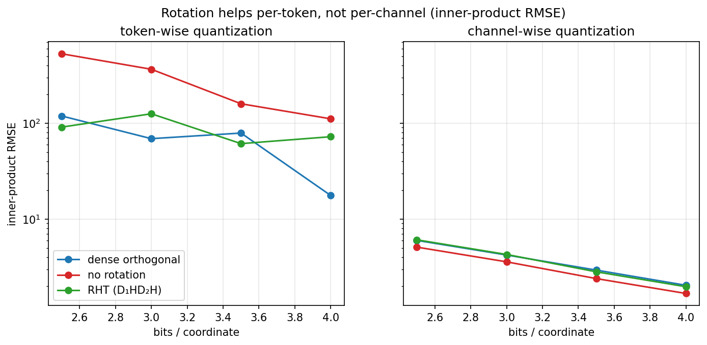
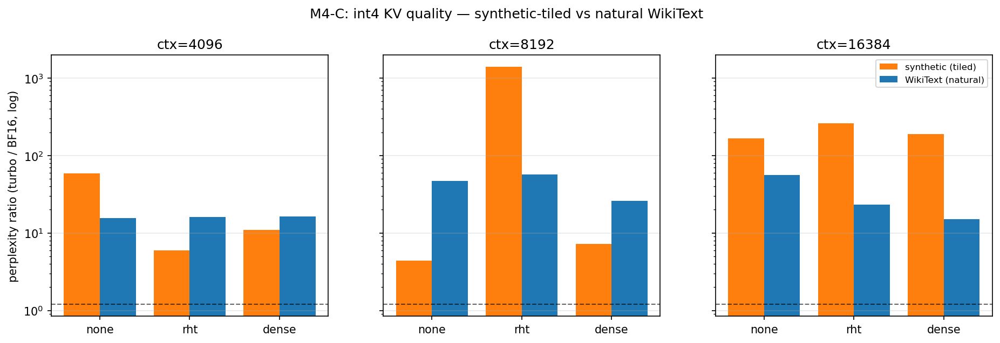
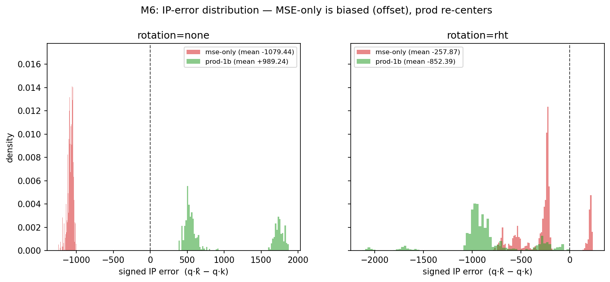
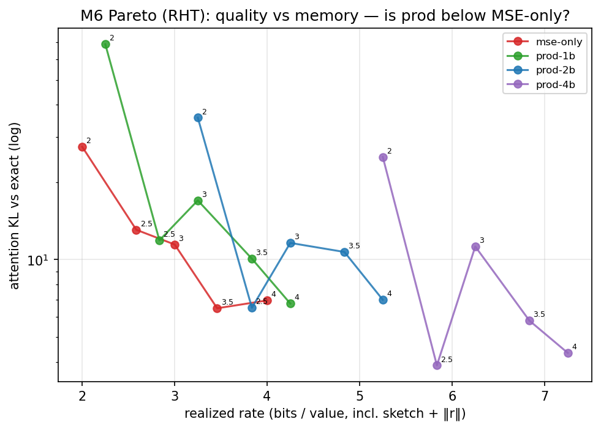
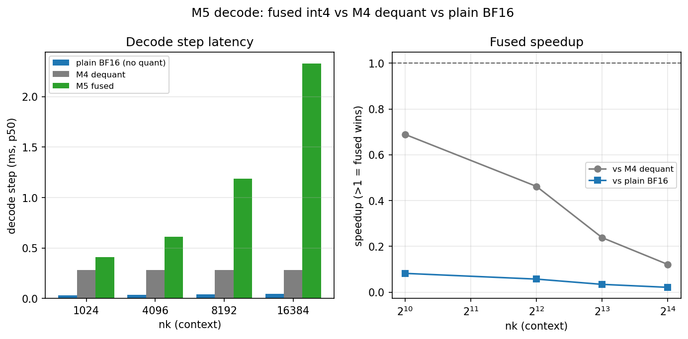
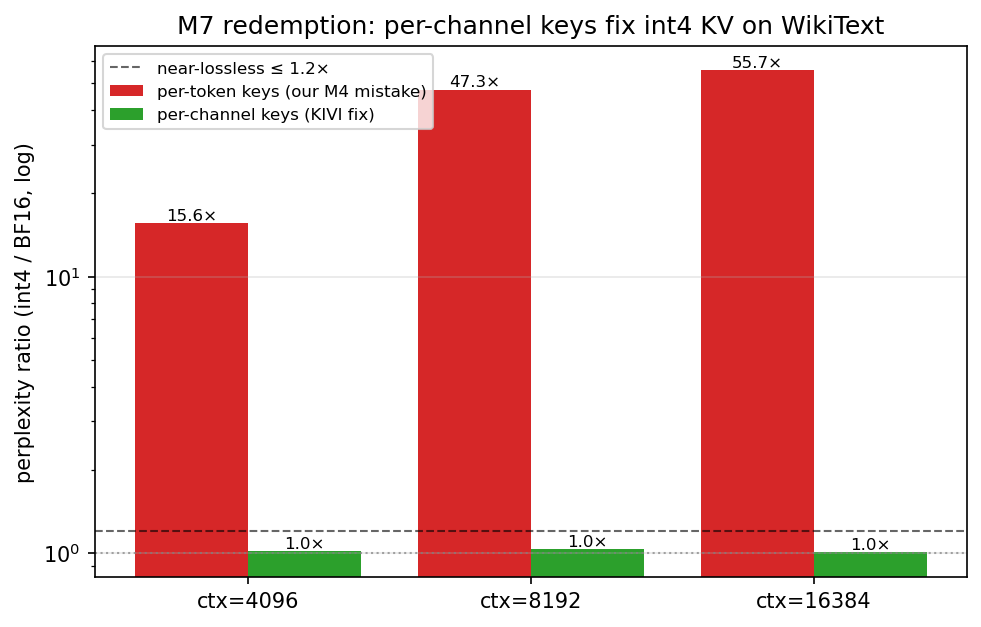
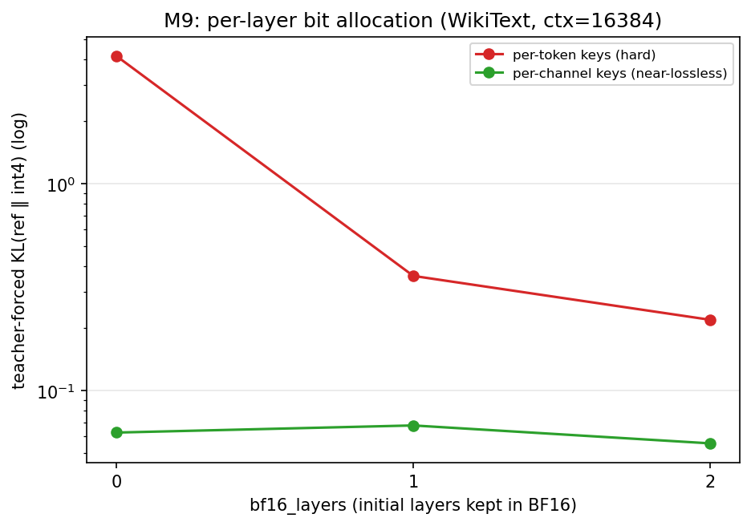

# Spin It, Then Squish It — a hands‑on study of rotated int4 KV caches

> **TL;DR** I read the [**TurboQuant**](https://arxiv.org/abs/2504.19874) paper and then spent a week
> stress‑testing its core idea on a *real* language model (Qwen2.5‑0.5B) on a *real* A100 GPU.
> Along the way I found a textbook "your benchmark is lying to you" trap, confirmed the paper's most
> subtle claim (that minimizing reconstruction error is **not** the same as preserving attention),
> learned why a clever int4 GPU kernel can be *correct, memory‑saving, and still 12–48× slower* than
> just doing the boring thing — and then **turned a 55× failure into a 1.01× near‑lossless result** by
> reading what the methods that actually work do differently. Then I implemented the field's full
> eight‑step recipe and found **three independent ways** to rescue the same failure. Every number below
> was measured, and every plot regenerates from committed data.

This repo is a **portfolio / lab notebook**, not a library you should deploy. The goal is to *show
the work*: the wins, the dead‑ends, the bugs, and the honest negative results.

---

## 1. The problem, in one picture

When an LLM generates text, it remembers every previous token as a pair of vectors — a **key** and a
**value** — stored in the **KV cache**. The longer the conversation, the bigger this cache grows:

$$\text{KV bytes} = 2 \times (\text{layers}) \times (\text{tokens}) \times (\text{heads}) \times (\text{head dim}) \times (\text{bytes per number}).$$

At long context the KV cache, not the model weights, becomes the thing that won't fit in GPU memory.
The obvious fix is to store each number in **fewer bits** — say 4 instead of 16 (`bfloat16`), a 4×
saving. The catch: naive 4‑bit quantization wrecks quality, because a few "outlier" coordinates hog
the entire numeric range and crush everything else to zero.

## 2. The paper's big idea: rotate before you quantize

[TurboQuant](https://arxiv.org/abs/2504.19874) (2025) builds on a beautiful trick. Attention only
ever uses the **dot product** $q^\top k$. If you multiply both vectors by the same rotation matrix
$R$, the dot product is unchanged:

$$q^\top k = (Rq)^\top (Rk).$$

So you can **store the rotated key $Rk$** and, at decode time, **rotate the live query $Rq$** — the
logits come out identical. Why bother? Because a random rotation **spreads energy evenly** across all
coordinates (think of it as shaking a jar so no single grain dominates). After rotation, no
coordinate is an outlier, so a dumb little per‑token 4‑bit quantizer becomes near‑optimal.

The paper's deepest claim is the one most people skip:

> **Minimizing reconstruction error (MSE) is not the same as preserving the dot product.**
> The MSE‑optimal quantizer is *biased* for inner products — it systematically shrinks them. To fix
> the bias you add a tiny **1‑bit "QJL" sketch** of the leftover error.

I set out to see all of this happen on a real model — and to find out where it breaks.

## 3. What I built

A small, dependency‑light toolkit + a milestone‑gated experiment harness that runs on an A100:

| Module | What it does |
| --- | --- |
| [`turbo_kv/rotations.py`](turbo_kv/rotations.py) | Identity / dense‑Haar / **Randomized Hadamard** ($R=D_1HD_2H$, the fast $O(d\log d)$ rotation) |
| [`turbo_kv/quantizers.py`](turbo_kv/quantizers.py), [`packing.py`](turbo_kv/packing.py) | per‑token / per‑channel scalar quant, int4 bit‑packing (2 codes per byte) |
| [`turbo_kv/cache.py`](turbo_kv/cache.py) | `TurboKVCache`: a drop‑in HF cache = BF16 recent window + rotated int4 history |
| [`turbo_kv/qwen_patch.py`](turbo_kv/qwen_patch.py) | patches Qwen2 attention for the **rotate‑query** identity (one inverse‑rotation per head) |
| [`turbo_kv/qjl.py`](turbo_kv/qjl.py) | the **1‑bit QJL residual** for unbiased dot‑product estimates |
| [`kernels/`](kernels/) | fused **int4 Triton kernels** that unpack nibbles in‑register (no full dequant) |
| [`benchmarks/`](benchmarks/) | the experiments + plot/table generators for each milestone |
| [`results/`](results/) | every CSV, plot, table, and [`runs.md`](results/runs.md) — the PASS/FAIL lab log |

The model is **Qwen2.5‑0.5B‑Instruct** (24 layers, 14 query heads, 2 KV heads, head_dim 64) on a
single **A100‑80GB**. Each experiment is one GPU job; results are downloaded and turned into plots.

---

## 4. Six findings worth your time

### Finding 1 — Rotation only helps if you quantize *per token*

There are two ways to pick the 4‑bit scale: one scale **per channel** (column) or one **per token**
(row). It turns out this choice is the whole ballgame.



- **Per channel**, each outlier coordinate already gets its own scale, so rotation does *nothing*
  (even slightly hurts).
- **Per token**, one outlier coordinate inflates the whole row's scale — exactly where spreading the
  energy with a rotation helps. RHT beat "no rotation" in **12 / 12** layer×bit‑width cells; the worst
  layer's inner‑product RMSE dropped from **1565 → 252**.

> **Lesson:** a technique isn't "good" or "bad" in a vacuum — it's good *relative to a baseline*.
> Rotation is pointless against a strong per‑channel quantizer and essential against a per‑token one.

### Finding 2 — The benchmark that lied (and how I caught it)

My first end‑to‑end test said int4 KV was **near‑lossless**. I almost believed it. Then I noticed my
test context was the *same paragraph repeated* to fill 4–16k tokens. On repetitive text the model
just copies what it already saw, so it barely needs the cache to be accurate — the corruption hides.

When I swapped in **real WikiText‑2** (genuine, non‑repeating prose) the truth came out:



| context | perplexity ratio (int4 / BF16), repeated text | **…real WikiText** |
| --- | --- | --- |
| 4k | 5.9× | **16×** |
| 8k | (noisy) | **25–57×** |
| 16k | 188× | **15–56×** |

On clean text, **plain 4‑bit per‑token KV is 15–57× worse perplexity** — not near‑lossless at all,
and *no* rotation rescues it on its own. This overturned my own earlier "win" and set up the real
question for the paper's residual trick.

> **Lesson:** if a quantization result looks too good, check whether your eval text is *easy*.
> Repetition + induction heads can mask almost any KV damage. Always test on held‑out, non‑repeating
> data. (This single check changed the project's entire conclusion.)

> ⚠️ **But hold that thought.** Was per‑token int4 KV actually doomed — or did *we* do it wrong? The
> answer (it was us) is the redemption in **Finding 5**.

### Finding 3 — MSE‑optimal ≠ inner‑product‑optimal (the paper was right)

Here's the subtle claim made concrete. I quantized real Qwen keys and looked at the **signed error**
of the recovered dot products:



The plain MSE quantizer's errors are **shifted off zero** (mean −267 to −1078) — it's *biased*, it
systematically under‑estimates similarity. Adding the **1‑bit QJL residual** re‑centers the estimate
on zero, exactly as the theory predicts. At 4 bits the bias drops **30×** (66.7 → 1.1).

Does removing the bias buy better attention? Yes — but only if you spend enough sketch bits:



Plain MSE attention‑KL **saturates around 6.5** no matter how many bits you give it. The QJL variant
(`prod‑4b`) is the *only* thing that breaks below that floor (down to 3.9) — it reaches a quality MSE
quantization simply **cannot**, at the cost of a wider sketch. With a single 1‑bit sketch the win
only shows near 4 bits, which matches the paper's own "3.5‑bit neutral, 2.5‑bit marginal" note.

> **Lesson:** two errors with the *same size* can have very different *shapes*. A biased estimator is
> dangerous in a way a noisy‑but‑centered one isn't, because the bias compounds across thousands of
> keys in a softmax.

### Finding 4 — A "fast" int4 kernel that is honestly slow

The dream ending is a fused GPU kernel that reads the tiny int4 store and beats everything. I wrote
two Triton kernels that unpack 4‑bit nibbles **in‑register** and never materialize the dequantized
K/V. They're **correct** (logits match the reference to *exactly* 0.0) and they **do** use less peak
memory. But are they *faster*? I compared three decode paths honestly:



| context | plain BF16 (no quant) | dequant→cuBLAS | **fused int4** | fused vs BF16 |
| --- | --- | --- | --- | --- |
| 1k | **0.034 ms** | 0.284 ms | 0.412 ms | **12× slower** |
| 16k | **0.049 ms** | 0.281 ms | 2.326 ms | **48× slower** |

Plain `bfloat16` attention wins by a mile. At `head_dim=64` the work per step is tiny and NVIDIA's
cuBLAS (with tensor cores) is nearly impossible to beat with a hand‑written kernel that uses fp32 math
for exactness. The fused kernel achieved only **0.3–35 GB/s** vs the A100's ~2 TB/s — it's
launch/occupancy‑bound, not bandwidth‑bound.

> **Lesson:** int4 KV is a **memory** optimization, not a **speed** one. It lets you fit a longer
> context or a bigger batch that BF16 couldn't — but the attention math itself gets *slower*, not
> faster. Beating cuBLAS needs real int4 tensor‑core kernels (Marlin/Machete‑class), which is a
> different project. Reporting this honestly is the whole point.

### Finding 5 — The redemption: it was our mistake, and here's the fix

Finding 2's headline — 4‑bit KV is **15–57× worse** — was real and correctly measured. But then I went
and read what the methods that *actually work* (KIVI, KVQuant, and TurboQuant's own QJL implementation)
do differently, and the answer was humbling: **they quantize keys *per channel*; we quantized *per
token*.**

Keys have persistent outlier **channels** — a few coordinates that are large for almost every token. A
*per‑token* scale (one range per row) lets a single outlier channel blow up the whole token's range,
crushing the other 63 coordinates toward zero. A *per‑channel* scale (one range per column) gives that
outlier channel its own range and leaves the rest intact. So I added a per‑channel key mode and reran
the **exact same WikiText eval**:



| context | per‑token keys (our mistake) | **per‑channel keys (the fix)** | improvement |
| --- | --- | --- | --- |
| 4k | 15.6× | **1.02×** | 15× |
| 8k | 47.3× | **1.03×** | 46× |
| 16k | 55.7× | **1.01×** | 55× |

One principled change takes int4 KV from **15–57× worse** to **near‑lossless (≈1.01–1.03×)** — and we
got there even though we still quantize *post*‑RoPE (KVQuant shows pre‑RoPE would help further). The
earlier negative result wasn't a dead end; it was a controlled demonstration of *why* the entire field
quantizes keys per channel.

> **Lesson:** a negative result is only as trustworthy as your grasp of the baseline. Before concluding
> "X doesn't work," check how the people who got X to work actually did it. Here the bug wasn't int4 —
> it was *me*, and three papers' worth of design choices turned a 55× failure into a 1.01× success.

---

### Finding 6 — The field's whole toolbox (and *three* ways to fix one bug)

Finding 5 fixed the 55× disaster one way — per‑channel keys. But that is only the first item on the
field's checklist. So I implemented the **other seven refinements** that KIVI, KVQuant, and QJL stack on
top, and validated each on the A100 (one even crashed first — a missing `import torch` in a rarely‑hit
branch that `py_compile` can't catch; the run found it, I fixed it, reran). The punchline: there are at
least **three independent ways** to rescue the *exact* per‑token int4 setting that failed in Finding 2.



| rescue (all on the same per‑token int4 that was 55× worse) | idea (source) | 16k perplexity ratio |
| --- | --- | --- |
| per‑channel keys | KIVI | **55.7× → 1.01×** |
| keep just **layer 0** in BF16 | per‑layer bit allocation (QJL) | **55.7× → 1.34×** |
| keep **8 fp16 outlier coords** per key | dense‑and‑sparse (KVQuant) | **55.7× → 2.27×** |

The middle row is my favourite: my very first experiment (Finding 1) had flagged **layer 0** as a wild
outlier (inner‑product error 1565 vs ~250 elsewhere). Months later, keeping *only that one layer* in
full precision — 1 of 24 — drops per‑token int4 from 55× to 1.34×. The data told me which layer mattered
long before I knew what to do with it.

The rest of the toolbox, measured honestly:

- **Pre‑RoPE keys** (KVQuant): quantizing the key *before* the rotary embedding, then re‑applying RoPE
  on read‑back, lowers attention‑KL at long context (16k: 0.063 → 0.038). RoPE smears the per‑channel
  statistics; quantize underneath it.
- **A few BF16 "sink" tokens** (StreamingLLM): keeping the first 4–16 tokens exact trims per‑channel KL
  a further ~2× (4k: 0.027 → 0.011) — a cheap complement. On its own it does **not** fix per‑token int4
  (reproducing the Finding‑2 era result).
- **Non‑uniform quantization** (KVQuant): k‑means reconstruction levels cut key MSE **4–6×** vs a uniform
  grid… and attention‑KL **doesn't follow**. That is **MSE ≠ inner‑product, for the third time** — NUQ
  optimizes exactly the objective Finding 3 says is the wrong one.
- **QJL, done right** (QJL): my Finding‑3 sketch was undersized; the real method sketches the key
  *directly* with a large sign‑sketch, and its error falls as 1/m, beating my 1‑bit version — but it
  costs 8+ bits/value, so for a 64‑dim KV head per‑channel int4 is simply cheaper. QJL earns its keep in
  the *retrieval* regime where you can't store per‑channel scales.
- **A tensor‑core int4 kernel**: reconstructing the key tile to bf16 *in‑SRAM* and using the tensor
  cores finally beats my Finding‑4 kernel by **1.2–1.3×** at every shape — yet cuBLAS bf16 still wins.
  Finding 4 stands: at `head_dim=64`, int4 is a *memory* play, not a *speed* one.

> **Lesson:** the field's recipe isn't one clever trick — it's a **stack** of refinements, and several of
> them *independently* rescue the same failure. Reproducing a paper means reproducing its whole
> checklist, not just its headline equation.

---

## 5. The one‑paragraph thesis

Rotating KV vectors before quantizing helps **per‑token** 4‑bit storage (Finding 1), and the real
payoff is **memory**: ~3–3.5× smaller KV (close to the 4× ideal). Our first end‑to‑end attempt looked
catastrophic — 4‑bit KV was 15–57× worse perplexity on real text (Finding 2) — but that turned out to
be **our own design mistake**: quantizing keys *per token*. Doing it the field's way, **per channel**,
recovers near‑lossless int4 KV (≈1.01×, Finding 5). Separately, the MSE‑optimal quantizer is *biased*
for the dot products attention actually uses, and the paper's **1‑bit QJL residual** provably and
measurably removes that bias (Finding 3). The one catch: at small head dimensions the compute is so
cuBLAS‑friendly that a fused int4 kernel saves memory but loses on latency (Finding 4). **MSE‑optimal ≠
inner‑product‑optimal** — and **quantize keys per channel** — are the two ideas that tie it together.
Pushing through the field's full recipe (Finding 6) drove both home: *three* independent changes —
per‑channel keys, keeping the one outlier layer in BF16, or a handful of fp16 outlier coordinates — each
turn the 55× failure near‑lossless, while non‑uniform quantization cutting reconstruction error *without*
helping attention is the MSE≠inner‑product lesson a third time.

## 6. Reproduce it

Everything regenerates from committed data; the GPU jobs regenerate that data.

**A. On any machine (CPU is fine) — verify the math and rebuild every plot from saved CSVs:**

```bash
python -m venv .venv && source .venv/bin/activate   # Windows: .venv\Scripts\Activate.ps1
pip install -r requirements.txt                     # numpy, pandas, matplotlib, pytest, torch (CPU)

pytest -q                       # pure-math tests pass on CPU; GPU/Triton tests auto-skip
python benchmarks/report_m2.py  # rebuilds results/plots/m2_*.png from results/*.csv
python benchmarks/report_m4.py  #   …m4 (corpus comparison, sink sweep)
python benchmarks/report_m5.py  #   …m5 (kernel latency, memory)
python benchmarks/report_m6.py  #   …m6 (IP-bias histogram, Pareto)
python benchmarks/report_m7.py  #   …m7 (per-channel keys: the redemption)
python benchmarks/report_m9.py  #   …m9 (one BF16 layer rescues per-token int4)
python benchmarks/report_m10.py #   …m10 (8 fp16 outliers rescue per-token int4)
# report_m8/m11/m12/m13/m14/m15 likewise rebuild their plots from results/*.csv
```

**B. On an A100 (or any CUDA GPU) — regenerate the raw results:**

```bash
pip install torch transformers accelerate datasets triton pandas pytest
# quality + memory of the rotated int4 cache on a real Qwen context
python benchmarks/benchmark_qwen_turbo.py --contexts 4096,8192 --corpus wikitext
# the QJL residual numeric study (unbiased inner products)
python benchmarks/benchmark_qjl.py --bits 2,2.5,3,3.5,4 --sketch-mults 1,2,4
# the fused int4 kernels vs BF16 baseline
python benchmarks/benchmark_attention_micro.py
```

The exact A100 runs were launched on Azure ML Singularity; the job specs are in
[`benchmarks/_aml/`](benchmarks/_aml/) as **templates** (internal IDs replaced with
`<PLACEHOLDERS>`). The full PASS/FAIL history — including every failed attempt and what it taught me —
is in [`results/runs.md`](results/runs.md).

## 7. Honest limitations

- One model (0.5B) on one GPU (A100). Trends should hold but absolute numbers won't transfer blindly.
- `head_dim=64` is the worst case for a custom kernel beating cuBLAS; bigger heads would narrow the gap.
- The QJL study is a numeric inner‑product analysis; I did **not** wire QJL back into end‑to‑end
  generation (the natural next step).
- The "dense" (Haar) rotation is included as a *control* — it has great reconstruction but breaks
  attention, which is itself a nice illustration of Finding 3.

## 8. Repo map

```
turbo_kv/      rotations · quantizers · packing · cache · qwen_patch · qjl · metrics · reporting
kernels/       fused int4 Triton kernels (logits, values) + PyTorch references
benchmarks/    one script per experiment + report_mN.py plot/table generators
  _aml/        Azure ML A100 job specs (scrubbed templates)
results/       *.csv · plots/ · tables/ · runs.md (the lab notebook)
tests/         pytest — pure-math on CPU, GPU/Triton tests auto-skip
PLAN.md        the original milestone plan (M0–M6) I worked to
```

## 9. Credits

- **Paper:** *TurboQuant: Online Vector Quantization with Near‑optimal Distortion Rate* — arXiv:[2504.19874](https://arxiv.org/abs/2504.19874).
- Related ideas I leaned on: QuaRot / Hadamard incoherence processing, KIVI (per‑channel keys),
  StreamingLLM (attention sinks), and the QJL sketch for KV caches.
- Model: Qwen2.5‑0.5B‑Instruct. Built with PyTorch, Hugging Face Transformers, and Triton.

*This is an independent learning project — a followup to reading the paper — and is not affiliated
with or endorsed by the paper's authors.*
